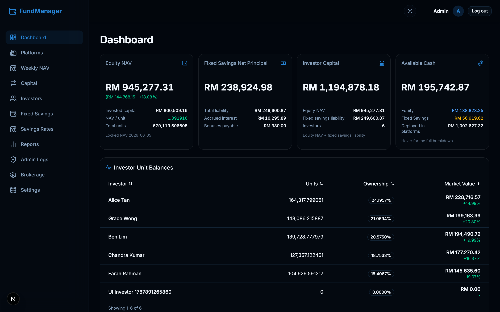
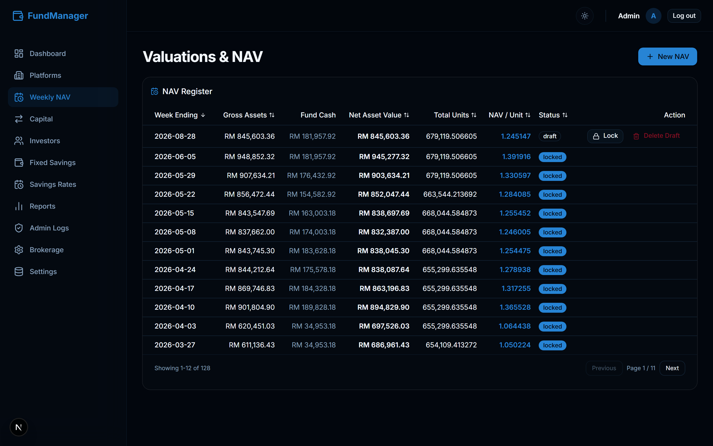
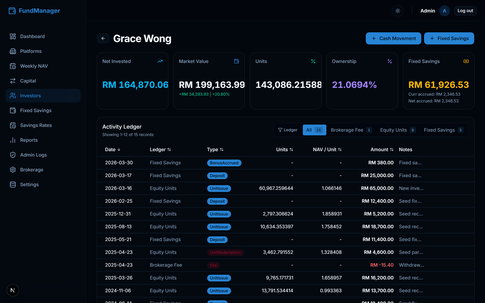
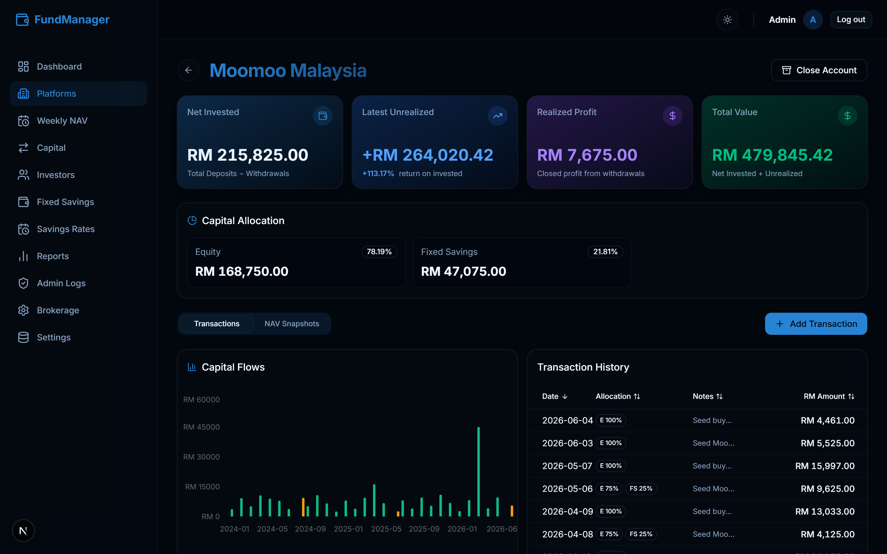
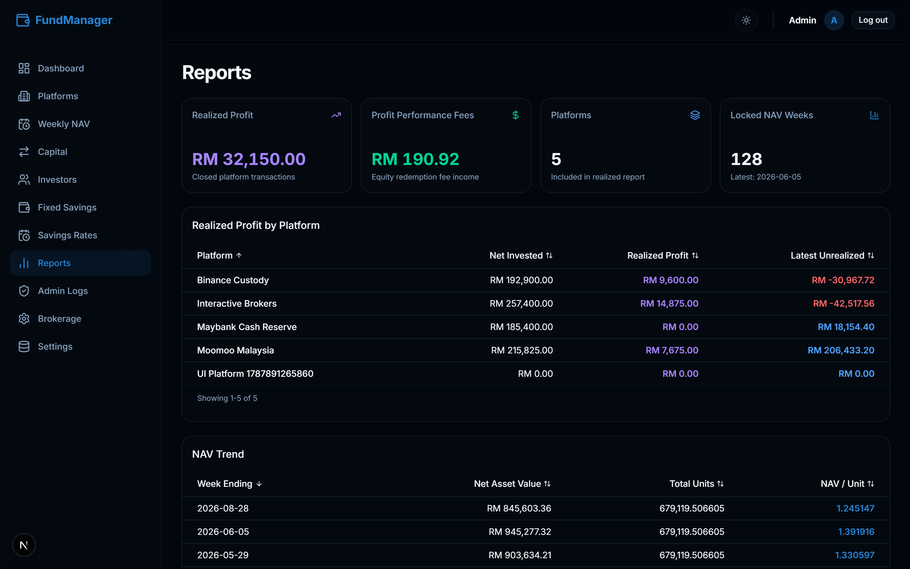
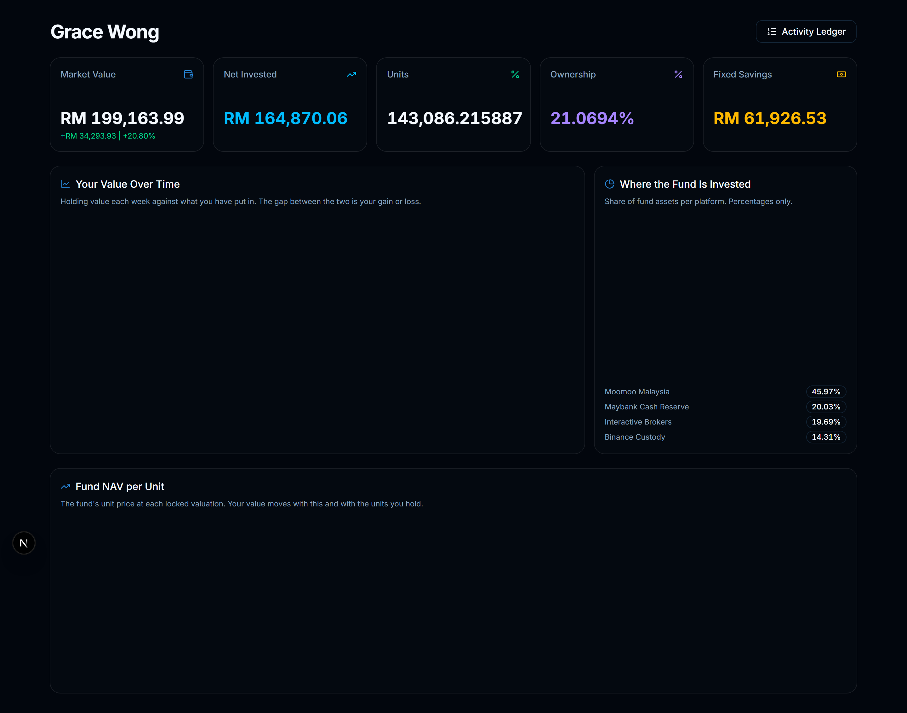

# Private Admin Fund Manager

A self-hosted web application for administering a **private, unit-based investment
fund** — the kind a small group of people run between themselves, where one person
keeps the books.

It prices investor units from real platform valuations, settles deposits and
withdrawals against a locked NAV, tracks a separate fixed-savings liability book,
records trading-platform performance, handles profit claims and performance fees,
and gives each investor a read-only statement link.


> **Not financial software for the public.** This is private bookkeeping software.
> It is **not** investment advice, tax advice, legal advice, a fundraising
> platform, a payment processor, or a regulated custody product. See
> [Scope and limitations](#scope-and-limitations).

## Live demo

**<https://private-admin-fund-manager.vercel.app>**

A public sandbox on sample data, backed by a throwaway database. Sign in at
`/admin/login` with **`admin` / `admin`** (the login form is pre-filled). Anyone
can sign in and change records — do not treat anything in the demo as private or
persistent.

## Screenshots

| Dashboard | NAV review |
| --- | --- |
|  |  |

| Investor statement | Trading platform |
| --- | --- |
|  |  |

| Reports | Investor portal (read-only) |
| --- | --- |
|  |  |

## What it does

- **Event-driven NAV accounting.** Create a NAV when you need to price something,
  not on a fixed calendar. NAV records are drafted, reviewed, then locked and
  become immutable.
- **Valuation from real marks.** Each trading platform is valued from the latest
  broker figure on or before the NAV date, with staleness tracking. A stale
  valuation on a large platform blocks settlement until it is refreshed.
- **Fund cash as its own balance.** Money pulled out of a platform stays in gross
  assets instead of vanishing. Expected vs. recorded bank balance is reconciled
  on screen, broken down per pool.
- **Investor units and equity performance.** Ownership, market value, cost basis,
  equity P&L, and return percentage per investor, with full statement history.
- **Capital movements.** Deposits issue units and withdrawals redeem units at the
  locked NAV per unit on or before the movement date. Backdating allowed,
  post-dating rejected.
- **Fixed-savings liability book.** Interest-bearing savings tracked outside
  equity NAV, with base rates and promotional rate periods.
- **Trading records.** Platforms, accounts, assets, transactions, funding-source
  allocation (equity or fixed savings), realized profit, and unrealized P&L. A
  platform account can be closed and reopened.
- **Profit claims and performance fees.** Claims are capped at attributable
  profit; settling a claim redeems the claimant's units so only their position
  shrinks. Performance fee is charged on realized gains and withheld from payout.
- **Brokerage reconciliation.** Non-equity investment P&L split into a realised
  account (cash returned above capital deployed) and an unrealised account (the
  mark on money still deployed), plus performance fees, accrued fixed-savings
  interest, bonuses, and a brokerage withdrawal workflow.
- **Audit log** with supported reversals and guardrails against unsafe historical
  edits.
- **Read-only investor portal** via private, rotatable bearer links with access
  logging — an activity ledger plus a dashboard of metrics and charts.
- **Manual JSON backup** export, validation, preview, and restore.

## How the accounting works (short version)

- Equity investors own **fund units**. Locked NAV per unit is the single source
  of truth for unit pricing.
- A trading platform records only three facts: **money in**, **money out**, and
  **value marks**. Profit is derived as `value − (money in − money out)`.
  Everything that stays inside the account (trades, dividends, fees, FX) is
  absorbed by the next value mark.
- **Gross assets = every platform's value + the fund's own cash.** The bank
  balance is not all equity's — savers' principal and the brokerage pot pass
  through the same account, so only equity's residual share prices the units.
- Late investors do not receive gains from before their units were issued.
- Fixed savings is a **liability**, excluded from equity NAV ownership.

The complete model — valuation resolution order, staleness/materiality rules,
fund-cash math, the operating cycle, and every edge case — is in
**[docs/OPERATIONS.md](docs/OPERATIONS.md)**.

## Tech stack

- **Next.js 16** App Router, **React 19**, **TypeScript**
- **Vercel Postgres** / Neon-compatible Postgres
- **Tailwind CSS v4**, Base UI / shadcn-style components, **Recharts**
- Server Actions for all mutations; signed `HttpOnly` session cookies for admin auth
- Node.js built-in test runner; headless Chromium/Edge E2E via Chrome DevTools Protocol

## Quickstart

Requires **Node.js 20+**, npm, and a Postgres database (Vercel Postgres, Neon, or
compatible).

```bash
git clone https://github.com/handsomelee002-ui/private-admin-fund-manager.git
cd private-admin-fund-manager
npm install
```

Create `.env.local` with your database connection and admin auth:

```env
POSTGRES_URL=postgresql://...
POSTGRES_URL_NON_POOLING=postgresql://...
POSTGRES_USER=...
POSTGRES_HOST=...
POSTGRES_PASSWORD=...
POSTGRES_DATABASE=...

ADMIN_LOGIN_ID=your-private-admin-login-id
ADMIN_PASSWORD_HASH=scrypt\$generated-salt\$generated-hash
AUTH_SESSION_SECRET=generated-session-signing-secret
```

Generate the password hash and session secret:

```bash
node scripts/generate-auth-config.mjs "a-private-password-of-at-least-12-characters"
```

> In `.env.local`, escape each `$` in `ADMIN_PASSWORD_HASH` as `\$`. In hosted
> environment-variable settings, use the raw hash without backslashes.

Run it:

```bash
npm run dev
```

Then open <http://localhost:3000>, sign in at `/admin/login`, open `/settings`,
enter the admin password in the protected gate, and run **Initialize Database**.
Full first-run steps (adding platforms, recording opening values, locking an
opening NAV) are in [docs/OPERATIONS.md](docs/OPERATIONS.md#first-time-setup).

## Scripts

| Command | Purpose |
| --- | --- |
| `npm run dev` | Development server with hot reload |
| `npm run build` / `npm run start` | Production build and server |
| `npm test` | Node unit tests |
| `npm run test:feature` | Database-backed feature tests (**destructive**) |
| `npm run test:e2e` | Browser E2E tests (**destructive**) |
| `npm run lint` / `npm run typecheck` | ESLint / TypeScript checks |
| `npm run verify` | Everything above, in order |

`test:feature`, `test:e2e`, and `verify` reset and mutate the configured
database. Run them only against a disposable test database.

## Security

This application handles sensitive financial records. **Do not deploy it
casually.** Before any public exposure:

- HTTPS only; dedicated production database; least-privilege DB credentials.
- Production-only admin credentials and session secret. **Rotate any credential
  ever committed, shared, logged, or used in local testing.**
- `NODE_ENV=production`, so development data tools (schema init, table drop,
  dummy import) are disabled.
- Treat backup JSON files and portal URLs as secrets.
- Put the app behind additional network controls where possible.

Portal links are **possession-based** — anyone with a valid portal URL can view
that investor's read-only ledger and dashboard until the link is rotated.

Full checklist: [docs/OPERATIONS.md](docs/OPERATIONS.md#security-notes).

## Scope and limitations

Deliberately **not** included:

- No multi-tenant isolation and no public self-registration.
- No payment processor and no investor password accounts.
- No formal compliance workflow, tax reporting, or market-data ingestion.
- No guarantee of regulatory suitability in any jurisdiction.

This is single-operator private administration software. Running it as a
multi-tenant public SaaS would require a separate authorization, tenancy, rate
limiting, monitoring, data-isolation, and compliance design.

## Documentation

- **[docs/OPERATIONS.md](docs/OPERATIONS.md)** — full operator manual: accounting
  model, access model, environment variables, first-time setup, verification,
  backup and restore, production checklist.
- **[AGENTS.md](AGENTS.md)** — engineering conventions for this codebase.

## Contributing

This is a personal project published for reference. Issues and discussion are
welcome; pull requests are not actively solicited.

## License

No license is currently declared. Without a license, this source is **All Rights
Reserved** — you may view it, but reuse, redistribution, and derivative works are
not permitted. Contact the author for permission.
